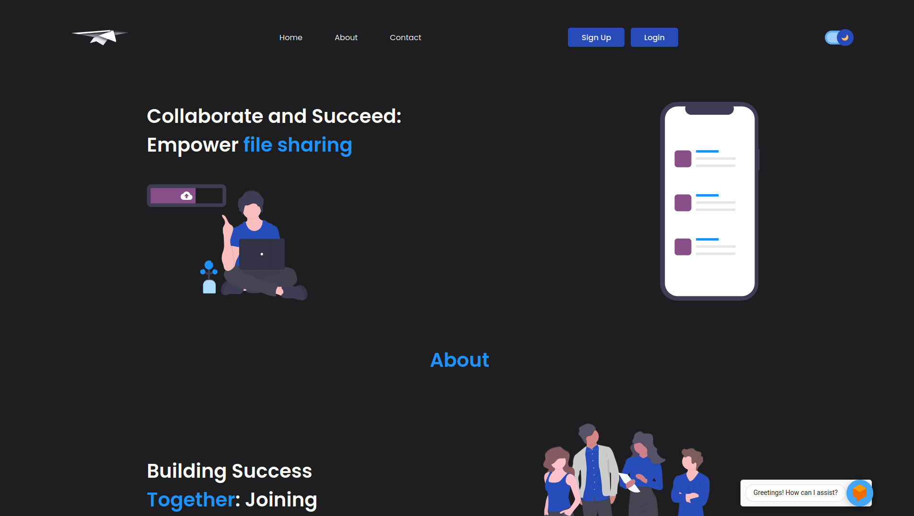

<!-- Banner -->

<center><a href="https://github.com/Dev-Aligator/SwiftSend-Web" title="SwiftSend"></a></center>
<!-- style="max-width=100%;" -->
<!-- Status -->

[]()
[]()
[]()
[]()
[](https://github.com/Dev-Aligator/SwiftSend-Web/pulls)
[]()
[]()
[]()
[]()
[](http://aligator.pythonanywhere.com/)

**SwiftSend** is a comprehensive platform designed for students and faculty members, providing them with a centralized location to upload and share various files, including study materials. It serves as a common hub where registered members can easily access and retrieve these resources. With SwiftSend, the process of file sharing and collaboration becomes streamlined and accessible to all users.

### Goal

SwiftSend aims to provide a common platform for college students and faculty members to securely upload and share various study materials. By offering a centralized resource-sharing platform, SwiftSend reduces the need to rely on social media platforms for sharing educational content. Additionally, our vision for the future includes expanding SwiftSend to serve as a comprehensive e-library, catering to the diverse needs of college students.

### Tech Stack

- HTML, CSS and Javascript
- Python <a href="https://docs.djangoproject.com/en/3.1/">Django</a> Framework

Hit <a href="#" title="Star SwiftSend" target="_self">:star2:</a> to show some :heart:

## Getting Started

These instructions will get you a copy of the project up and running on your local machine for development and testing purposes.

### Development Environment Setup: Linux


<details>
<summary>
Step 1: Installing Python 3.10
</summary>
<br>
Download <a href="https://www.python.org/downloads/">Python 3.10 or higher</a>
<br><br>

```bash
  sudo pacman -S python3
```

</ul>

Verify the installation from the command prompt (Terminal) using the following command,

```bash
  python --version
```

Installed version of python will be printed.
</details>

---

<details>
<summary>
Step 2: Installing Git
</summary>
<br>

```bash
  sudo pacman -S git
```

</details>

---

<details>
<summary>
Step 3: Clone the Repository
</summary>
<br>

```bash
  git clone https://github.com/Dev-Aligator/SwiftSend-Web
```

</details>

---


<details>
<summary>
Step 4: Creating Virtual Environment
</summary>
<br>
Install virtualenv
<br><br>

```bash
pip3 install virtualenv
```

Creating Virtual Environment named `myvenv`

```bash
virtualenv myvenv -p python3.7
```

To Activate `myvenv`

```bash
myvenv\Scripts\activate
```

To deactivate `myvenv`

```bash
deactivate
```
</details>

---

<details>
<summary>
Step 5: Installing Requirements
</summary>
<br>
Note: Before installing requirements, Make sure Virtual Environment is activated.
<br><br>

```bash
pip install -r requirements.txt
```
</details>

---

<details>
<summary>
Step 6: Making database migrations
</summary>
<br>

```bash
python manage.py makemigrations
python manage.py migrate
```
</details>

---

<details>
<summary>
Step 7: Creating superuser to access Admin Panel
</summary>
<br>

```bash
python manage.py createsuperuser
```
</details>

---

<details>
<summary>
Step 8: Running the Project in local server
</summary>
<br>
<b>Note:</b> Before running the project in local server, Make sure you activate the Virtual Environment.
<br><br>

```bash
python manage.py runserver
```
</details>

---


## License

This project is licensed under the MIT License - see the <a href="https://github.com/Dev-Aligator/SwiftSend-Web/LICENSE">LICENSE.md</a> file for details.

---

<p align="center">Dev-Aligator</p>
<p align="center">
<a href="https://github.com/Dev-Aligator/">

</a>
</p>
